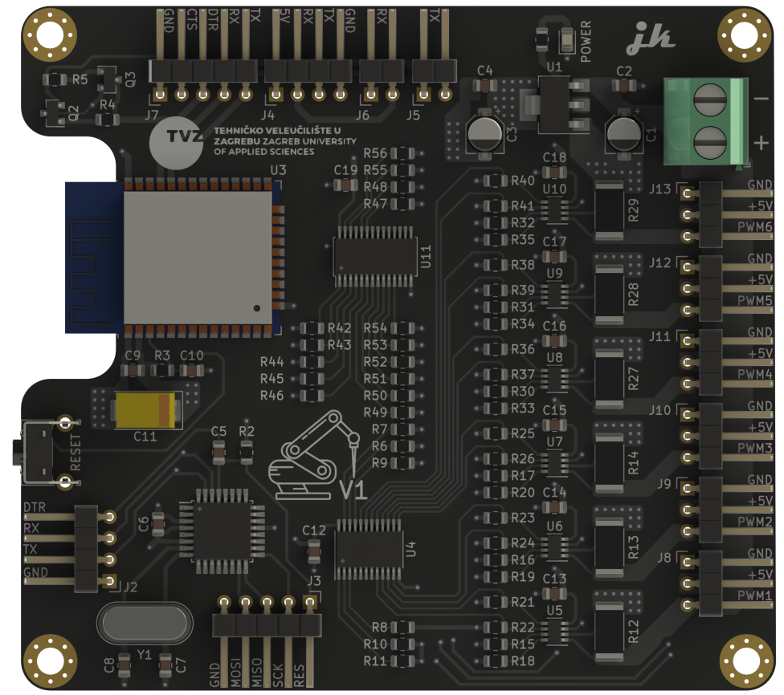

# Robotska-ruka
## What is it?
Board used for controlling multiple servo motors and their measurement of current.

WiFI capability via ESP32.

## Project status
Development stopped.

## Images

## Project folder structure
    .
    ├── ...
    ├── Images                  # Project images folder
    ├── Output files            # Gerber files folder
    ├── KiCad files             # Main folder
    ├── Schematic.pdf           # Schematic in .pdf format
    └── ...
